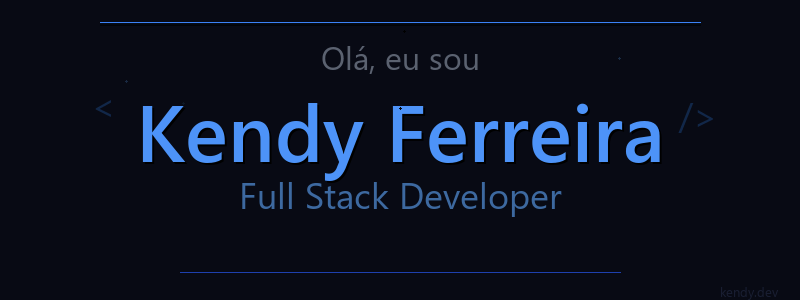

  

  

---

## 🧑‍💻 About Me

- **Kendy Ferreira**
- Graduado em Sistemas de Informação pela Universidade Federal de Sergipe (UFS) 🎓
- Técnico em Manutenção e Suporte em Informática pelo Instituto Federal de Sergipe (IFS)
- Atualmente trabalhando na **SEFAZ** como Analista de Sistemas
- **Full Stack Developer** com **1 ano de experiência**
- Foco em **Java**, **Python**, **Next.js + Tailwind CSS**, **Node.js**
- Dia a dia: **Java**, **JavaScript**, **Oracle 19c**, **Docker**, **APIs REST**
- Entusiasta de **Inteligência Artificial**

---

## 🚀 Main Skills

  

---

## 🔎 Currently Learning

  

---

## 📌 No Momento

> Atualmente trabalhando como **Analista de Sistemas**, focando em sistemas com **Java** e **Oracle 19c**, integrando **APIs REST** e automatizando processos com **Docker**. Paralelamente, explorando **Inteligência Artificial** e **Machine Learning** com Python.

---

## 💼 Daily Tools

  

---

  

---

   

---

## 📫 Connect with Me

  

---

  ✨ Thanks for visiting my profile!

